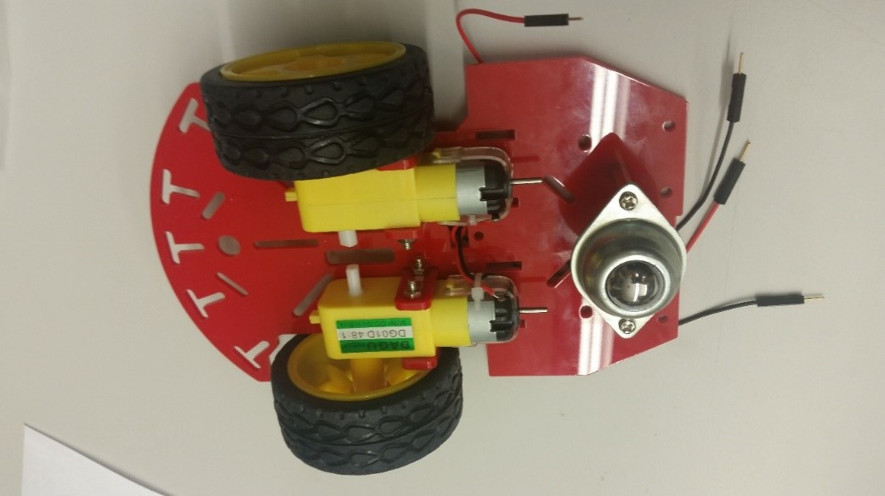

# Assembling the Duckiebot `C0` {#assembling-duckiebot-c0 status=beta}

Assigned: Shiying

Point of contact: Shiying Li

Once you have received the parts and soldered the necessary components, it is time to assemble them in a Duckiebot. Here, we provide the assembly instructions for configurations `C0+wjd`.

Requires: Duckiebot `C0+wjd` parts. The acquisition process is explained in .

Requires: Having soldered the `C0+wjd` parts. The soldering process is explained in .

Requires: Having prepared the power cable. The power cable preparation is explained in . Note: Not necessary if you are proceeding directly to configuration C1.

Requires: Having installed the image on the MicroSD card. The instructions on how to reproduce the Duckiebot system image are in .

Requires: Time: about 40 minutes.

Results:  An assembled Duckiebot in configuration `C0+wjd`.

Comment: add "next step(s)" as a standard field in the requirements class? -JT

Comment: Notes - if we have the bumpers, at what point should we add them? I think that the battery could actually be attached before the levels of the chassis are joined. I found it hard to mount the camera (the holes weren't lining up). the long camera cable is a bit annoying - I folded it and shoved it in between two hats. We should decide if PWM hat is part of this configuration, why not leave it for now and forget about the spliced cable for the class. I found that the screwdriver that comes with the chassis kit is too fat to screw in the wires on the hat. The picture of where to put the ziptie for the battery is not very clear. need something to cut the end of the ziptie with.

Comment: In general I would recommend having diagonal pliers as well as a few mini screwdrivers at hand. Both can be obtained from a local dollar store for about 6$ total. The pliers / cutters are required either for making your own power cord or for cutting the zipties after they've been attached to the chassis (because they are too long). The screwdrivers are required for tightening the screws on the hats after the cables have been plugged in because the chassis screwdriver is too wide for that.

## Chassis

Open the Magician chassis package and take out the following components:

* Chassis-bottom (1), Chassis-up (1)
* DC Motors (2), motor holders (4)
* Wheels (2 pieces), steel omnidirectional wheel (1) or caster wheel (1)
* All spacers and screws
* Screwdriver

     

Note: You won’t need the battery holder and speed board holder (on the right side in ).

### Bottom

Insert the motor holders on the chassis-bottom and put the motors as shown in the figure below (with the longest screws (M3x30) and M3 nuts).

     

     

     

Note: Orient the motors so that their wires are inwards, i.e., towards the center of the chassis-bottom. The black wires should be closer to the chassis-bottom to make wiring easier down the line.

Note: if your Magician Chassis package has unsoldered motor wires, you will have to solder them first. Check these instructions [make instructions for soldering motor wires]. In this case, your wires will not have the male pin headers on one end. Do not worry, you can still plug them in the stepper motor hat power terminals.

### Wheels

Plug in the wheels to the motor as follows (no screws needed):

     

     

### Omnidirectional wheel

The Duckiebot is driven by controlling the wheels attached to the DC motors. Still, it requires a "passive" omnidirectional wheel on the back.

If you have purchased the optional caster wheel, read on to the next section.

The Magician chassis package contains a steel omnidirectional wheel, and the related standoffs and screws to secure it to the chassis-bottom part.

     

     

#### Caster wheel

TODO: add instructions for Caster wheel assembly.

### Mounting the spacers

Put the car upright (omni wheel pointing towards the table) and arrange wires so that they go through the center rectangle. Put 4 spacers with 4 of M3*6 screws on each corner as below.

     

     

The bottom part of the Duckiebot's chassis is now ready. The next step is to assemble the Raspberry Pi on chassis-top part.

Comment: These spacers are not the ones provided in the box, change pic. -JT

## Assembling the Raspberry Pi, camera, and HATs

<!--
Materials:

* Chassis-up,
* Camera and camera mount,
* M3*10 flathead screws and M3 nuts from the Duckiebot package.
* 4 M-F Nylon M3x5+6mm standoff spacers, 3x0.5mm screws, Nylon nuts
* Raspberry Pi 3 – Model B
* Soldered PWM/Servo HAT and Soldered Stepper Motor HAT,
* 1 Male-male wire,
* Standoffs
* Heat sinks
-->

### Raspberry Pi

Before attaching anything to the Raspberry Pi you should add the heat sinks to it. There are 2 small sinks and a big one. The big one best fits onto the processor (the big "Broadcom"-labeled chip in the center of the top of the Raspberry Pi). One of the small ones can be attached to the small chip that is right next to the Broadcom chip. The third heat sink is optional and can be attached to the chip on the underside of the Raspberry Pi. Note that the chip on the underside is bigger than the heat sink. Just mount the heat sink in the center and make sure all of them are attached tightly.

When this is done fasten the nylon standoffs on the Raspberry Pi, and secure them on the top of the chassis-up part by tightening the nuts on the opposite side of the chassis-up.

     

     

     

     

#### Micro SD card

Requires: Having the Duckiebot image copied in the Micro SD card.

Take the Micro SD card from the Duckiebox and insert its slot on the Raspberry Pi. The SD card slot is just under the display port, on the short side of the PI, on the flipside of where the header pins are.

    

### Camera

#### The Raspberry Pi end

First, identify the camera cable port on the Pi (between HDMI and power ports) and remove the orange plastic protection (it will be there if the Pi is new) from it. Then, grab the long camera cable (300 mm) and insert in the camera port. To do so, you will need to gently pull up on the black connector (it will slide up) to allow the cable to insert the port. Slide the connector back down to lock the cable in place, making sure it “clicks”.

Protip: Make sure the camera cable is inserted in the right direction! The metal pins of the cable should be in contact with the metal terminals in the camera port of the PI.

     

Note: Insert the cable in the right direction to connect the camera to the Raspberry Pi.

Comment: insert picture with long camera cable, not short one. -JT

#### The camera end

If you have purchased the long camera cable, the first thing to do is removing the shorter cable that comes with the camera package. Make sure to slide up the black connectors of the camera-camera cable port in order to unblock the cable.

Take the rear part of the camera mount and use it hold the camera in place. Note that the camera is just press-fitted to the camera mount, no screws/nuts are needed.

In case you have not purchased the long camera cable, do not worry! It is still very possible to get a working configuration, but you will have little wiggling space and assembly will be a little harder.

Place the camera on the mount and fasten the camera mount on the chassis-up using M3*10 flathead screws and M3 nuts from the Duckiebox.

Protip: make sure that the camera mount is: (a) geometrically centered on the chassis-up; (b) fastened as forward as it can go; (c) it is tightly fastened. We aim at having a standardized position for the camera and to minimize the wiggling during movement.

     

_Notice: make sure that the cable is oriented in this direction (writing towards the CPU). Otherwise you will have to disassemble the whole thing later._

### Assemble chassis-bottom and chassis-up

#### Arrange the motor wires through the chassis-up, which will be connected to Stepper Motor HAT later.

     

#### Extending the intra-decks standoffs

In order to fit the battery, we will need to extend the Magician Chassis standoffs with the provided nylon standoff spacers. Grab 4 of them, and secure them to one end of the long metal standoffs provided in the Magician Chassis package.

Secure the extended standoff to the 4 corners of the chassis-bottom.  The nylon standoffs should smoothly screw in the metal ones. If you feel resistance, don’t force it or the nylon screw might break in the metal standoff. In that case, unscrew the nylon spacer and try again.

     

     

### Put a Stepper Motor HAT with 4 standoffs on the top of Raspberry Pi

The GPIO Stacking Header need to be correctly stacked into the pins before fastening the standoffs. It connects the Pi with the HAT.
Place the camera cable properly when you mount the HAT on the Raspberry Pi.

     

     

### Connect the motor's wires to the terminal

#### We are using M1 and M2. The left (in robot frame) motor is connected to M1 and the right motor is connected to M2. If you have followed Part A correctly, the wiring order will look like as following pictures:
LeftMotor:Red - LeftMotor:Black - RightMotor:Black - RightMotor:Red

####  Find a male-male wire (power from HAT to HAT) and connect it to +5V input as below. The other end will be connected to the upper layer, which delivers the power to the motor HAT.

_Notice: In order to fully tighten the screw terminal connectors, you will need a screwdriver with a maxium shaft diameter of 1.9mm. The provided screwdriver exceeds this width, and will not be able to fully tighten the screw terminal. When fastened, the top of the screw head should be seated at least 2mm below the deck of the screw terminal block._

     

     

### PWM HAT

Put a Servo/PWM Pi HAT board (in your Duckiebox) with 4 standoffs. Connect the male-male wire to +5V output.

     

### Battery

Put the battery between the upper and lower decks of the chassis. It is recommended to, secure the battery from moving using zip ties.

     

### Joypad

TODO: Connect the joypad dongle

TODO: Insert 2AA batteries in the joypad

TODO: Insert relevant pics

### Connect the power cables
Connect power cables (USB A to 5mm cable in your Duckiebox and USB cable in the battery box). Arrange all the cables properly so that the Duckiebot can run on the way without barrier.

     

     

