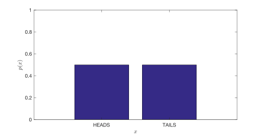
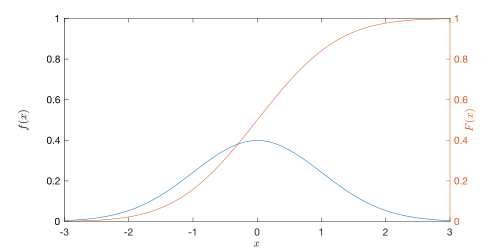
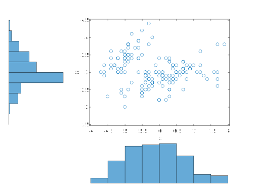
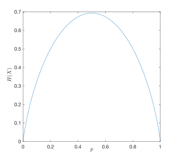

# Probability basics {#probability_basics status=beta}

In this chapter we give a brief review of some basic probabilistic concepts. For a more in-depth treatment of the subject we refer the interested reader to a textbook such as .

## Random Variables {#random_variables}

The key underlying concept in probabilistic theory is that of an *event*, which is the output of a random trial. Examples of an event include the result of a coin flip turning up HEADS or the result of rolling a die turning up the number "4".

\begin{definition}[Random Variable]\label{def:random_variable}
A  (either discrete or continuous) variable that can take on any value that corresponds to the feasible output of a random trial.
\end{definition}

For example, we could model the event of flipping a fair coin with the random variable $X$. We write the probability that $X$ takes $HEADS$ as $p(X=HEADS)$. The set of all possible values for the variable $X$ is its *domain*, $\aset{X}$. In this case,
\[
    \aset{X}=\{HEADS,TAILS\}.
\]
     Since $X$ can only take one of two values, it is a *binary* random variable. In the case of a die roll,
\[
    \aset{X}=\{1,2,3,4,5,6\},
\]
and we refer to this as a *discrete* random variable. If the output is real value or a subset of the real numbers, e.g., $\aset{X} = \reals$, then we refer to $X$ as a *continuous* random variable.

Personally, I don't like using math formatting for letters or words that don't denote symbols, e.g., $X = HEADS$ v.s. $X= \text{HEADS}$ - MW

Consider once again the coin tossing event. If the coin is fair, the have $p(X=HEADS)=p(X=TAILS)=0.5$. Here, the function $p(x)$ is called the *probability mass function* or pmf. The pmf is shown in .

  

Here are some very important properties of $p(x)$:
- $0\leq p(x) \leq (1)$
- $\sum_{x\in\aset{X}}=1$

In the case of a continuous random variable, we will call this function $f(x)$ and call it a *probability density function*, or pdf.

In the case of continuous RVs, technically the $p(X=x)$ for any value $x$ is zero since $\aset{X}$ is infinite. To deal with this, we also define another important function, the *cumulative density function*, which is given by $F(x) \triangleq p(X\leq x)$, and now we can define $f(x) \triangleq \frac{d}{dx}F(x)$. A pdf and corresponding cdf are shown in  (This happens to be a Gaussian distribution, defined more precisely in .).

  

### Joint Probabilities {#joint}

If we have two different RVs representing two different events $X$ and $Y$, then we represent the probability of two distinct events $x \in \aset{X}$ and $y \in \mathcal{Y}$ both happening, which we will denote as following: $p(X=x \; \text{AND} \; Y=y) = p(x,y)$. The function $p(x,y)$ is called *joint distribution*.

### Conditional Probabilities {#conditional}

Again, considering that we have to RVs, $X$ and $Y$, imagine these two events are linked in some way. For example, $X$ is the numerical output of a die roll and $Y$ is the binary even-odd output of the same die roll. Clearly these two events are linked since they are both uniquely determined by the same underlying event (the rolling of the die). In this case, we say that the RVs are *dependent* on one another. In the event that we know one of events, this gives us some information about the other. We denote this using the following *conditional distribution* $p(X=x \; \text{GIVEN} \; Y=y = p(x|y)$.

Write down the conditional pmf for the scenario just described assuming an oracle tells you that the die roll is even. In other words, what is p(x|EVEN)?

(Warning: if you think this is very easy that's good, but don't get over-confident.)

Comment: I love editing. -AC

The joint and conditional distributions are related by the following (which could be considered a definition of the joint distribution):

\begin{equation}
p(x,y) = p(x|y)p(y)
\label{eq:joint}
\end{equation}

and similarly, the following could be considered a definition of the conditional distribution:

\begin{equation}
p(x|y) = \frac{p(x,y)}{p(y)} \text{if} p(y) > 0
\label{eq:condition}
\end{equation}

We need to add spacing - MW

In other words, the conditional and joint distributions are inextricably linked (you can't really talk about one without the other).

I don't really have anything to say.

Just wanted to show the comment system.

Note that I can just go and on with my rambling; all this text will be collapsed anyway.

(Keep this comment as an example.)

-AC

If two variables are *independent*, then the following relation holds: $p(x,y)=p(x)p(y)$.

### Bayes' Rule {#bayes}

Upon closer inspection of \eqref{eq:joint}, we can see that the choice of which variable to condition upon is completely arbitrary. We can write:

\[
p(y|x)p(x) = p(x,y) = p(x|y)p(y)
\]

and then after rearranging things we arrive at one of the most important formulas for mobile robotics, Bayes' rule:

\begin{equation}
p(x|y) = \frac{p(y|x)p(x)}{p(y)}
\label{eq:bayes}
\end{equation}

Exactly why this formula is so important will be covered in more detail in later sections (TODO), but we will give an initial intuition here.

Consider that the variable $X$ represents something that we are trying to estimate but cannot observe directly, and that the variable $Y$ represents a physical measurement that relates to $X$. We want to estimate the distribution over $X$ given the measurement $Y$, $p(x|y)$, which is called the *posterior* distribution. Bayes' rule lets us to do this.
For every possible state, you take the probability that this measurement could have been generated, $p(y|x)$, which is called the *measurement likelihood*, you multiply it by the probability of that state being the true state, $p(x)$, which is called the *prior*, and you normalize over the probability of obtaining that measurement from any state, $p(y)$, which is called the *evidence*.

From Wikipedia:
Suppose a drug test has a 99% true positive rate and a 99% true negative rate, and that we know that exactly 0.5% of people are using the drug. Given that a person's test gives a positive result, what is the probability that this person is actually a user of the drug.

Answer: $\approx$ 33.2%.
This answer should surprise you. It highlights the power of the *prior*.

### Marginal Distribution

If we already have a joint distribution $p(x,y)$ and we wish to recover the single variable distribution $p(x)$, we must *marginalize* over the variable $Y$. The involves summing (for discrete RVs) or integrating (for continuous RVs) over all values of the variable we wish to marginalize:

\begin{align}
p(x) &= \sum_{\mathcal{Y}} p(x,y)
f(x) &= \int p(x,y) dy
\end{align}

This can be thought of as projecting a higher dimensional distribution onto a lower dimensional subspace. For example, consider , which shows some data plotted on a 2D scatter plot, and then the marginal histogram plots along each dimension of the data.

  

Marginalization is an important operation since it allows us to reduce the size of our state space in a princpled way.

### Conditional Independence {#cond-independence}

Two RVs, $X$ and $Y$ may be correlated, we may be able to encapsulate the dependence through a third random variable $Z$. Therefore, if we know $Z$

  

Is there a discussion of graphical models anywhere? Doing a good job of sufficiently describing graphical models and the dependency relations that they express requires careful thought. Without it, we should refer readers to a graphical models text (e.g., Koller and Friedman, even if it is dense)

### Moments {#moments}

The $n$th moment of an RV, $X$, is given by $E[X^n]$ where $E[]$ is the expection operator with:

\[
   E[f(X)] = \sum_{\aset{X}} x \, f(x)
\]
in the discrete case and
\[
   E[f(X)] = \int x\, f(x) dx
\]
in the continuous case.

The 1st moment is the *mean*, $\mu_X=E[X]$.

The $n$th central moment of an RV, $X$ is given by $E[(X-\mu_X)^n]$. The second central moment is called the *covariance*, $\sigma^2_X=E[(X-\mu_X)^2]$.

### Entropy {#entropy}

\begin{definition}\label{def:entropy}
The *entropy* of an RV is a scalar measure of the uncertainty about the value the RV.
\end{definition}

A common measure of entropy is the *Shannon entropy*, whose value is given by

\begin{equation}
H(X)=-E[\log_2 p(x)]
\label{eq:shannon}
\end{equation}

This measure originates from communication theory and literally represents how many bits are required to transmit a distribution through a communication channel. For many more details related to information theory we recommend .

As an example, we can easily write out the Shannon entropy associated with a binary RV (e.g. flipping a coin) as a function of the probability that the coin turns up heads (call this $p$):

\begin{equation}
H(X) = -p\log_2 p - (1-p)\log_2 (1-p)
\label{eq:binary_entropy}
\end{equation}

  

Notice that our highest entropy (uncertainty) about the outcome of the coin flip is when it is a fair coin (equal probability of heads and tails). The entropy decays to 0 as we approach $p=0$ and $p=1$ since in these two cases we have no uncertainty about the outcome of the flip. It should also be clear why the function is symmetrical around the $p=0.5$ value.

### The Gaussian Distribution {#gaussian}

In mobile robotics we use the Gaussian, or normal, distribution a lot.

Comment: The banana distribution is the official distribution in robotics! - AC

Comment: The banana distribution is Gaussian! http://www.roboticsproceedings.org/rss08/p34.pdf - LP

The 1-D Gaussian distribution pdf is given by:

\begin{equation}
\mathcal{N}(x|\mu,\sigma^2) = \frac{1}{\sqrt{2\pi \sigma^2}}e^{-\frac{1}{2\sigma^2}(x-\mu)^2}
\label{eq:gaussian1D}
\end{equation}

where $\mu$ is called the *mean* of the distribution, and $\sigma$ is called the *standard deviation*. A plot of the 1D Gaussian was previously shown in .

We will rarely deal with the univariate case and much more often deal with the multi-variate Gaussian:

\begin{equation}
\mathcal{N}(\state|\bmu,\bSigma) = \frac{1}{(2*\pi)^{D/2}|\bSigma|^{1/2}}\exp[-\frac{1}{2}(\state-\bmu)^T\bSigma^{-1}(\state - \bmu)]
\label{eq:gaussianND}
\end{equation}

The value from the exponent: $(\state-\bmu)^T\bSigma^{-1}(\state - \bmu)$ is sometimes written
$||\state - \bmu||_\bSigma$ and is referred to as the *Mahalanobis distance* or *energy norm*.

Mathematically, the Gaussian distribution has some nice properties as we will see. But is this the only reason to use this as a distribution. In other words, is the assumption of Gaussianicity a good one?

There are two very good reasons to think that the Gaussian distribution is the "right" one to use in a given situation.

1. The *central limit theorem* says that, in the limit, if we sum an increasing number of independent random variables, the distribution approaches Gaussian

2. It can be proven (TODO:ref) that the Gaussian distribution has the maximum entropy subject to a given value for the first and second moments. In other words, for a given mean and variance, it makes the *least* assumptions about the other moments.

Exercise: derive the formula for Gaussian entropy
