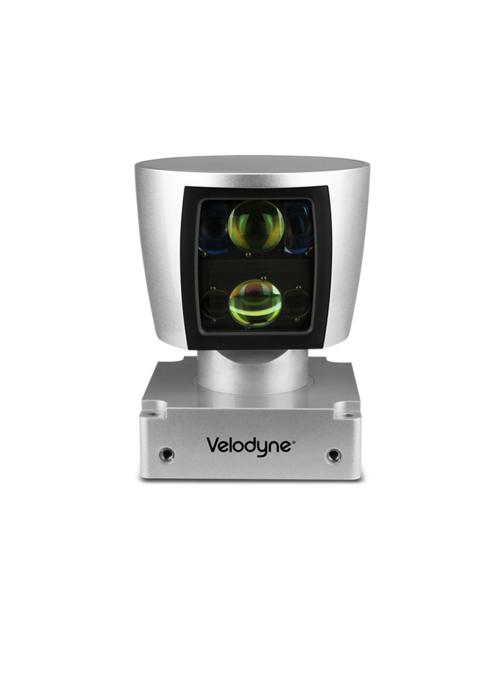
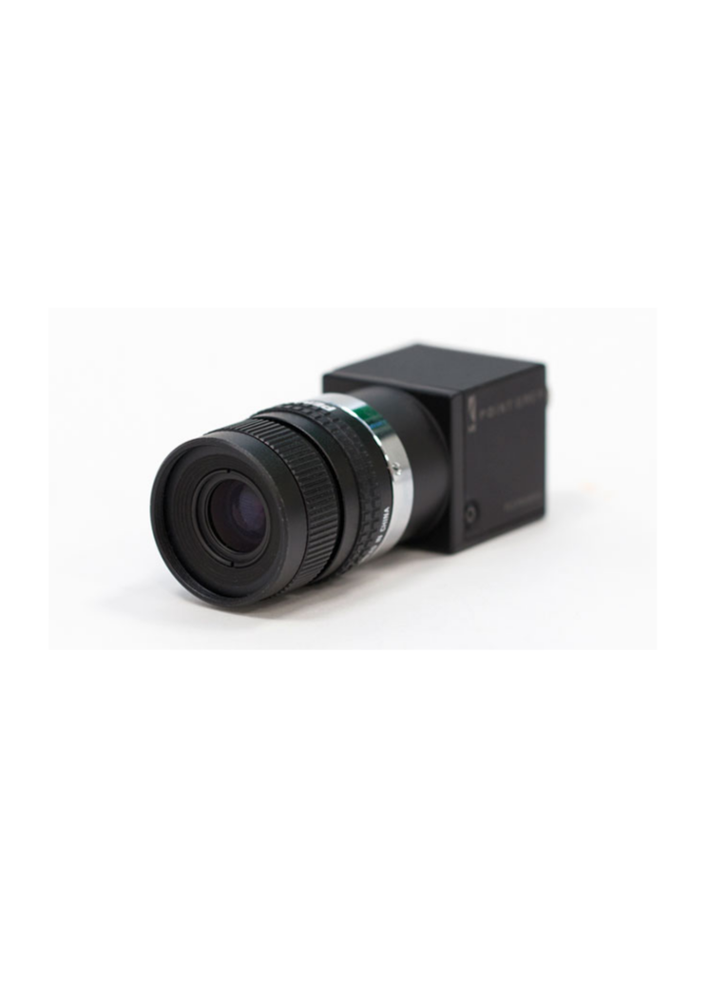
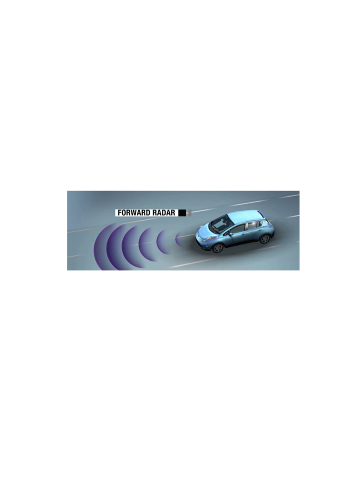
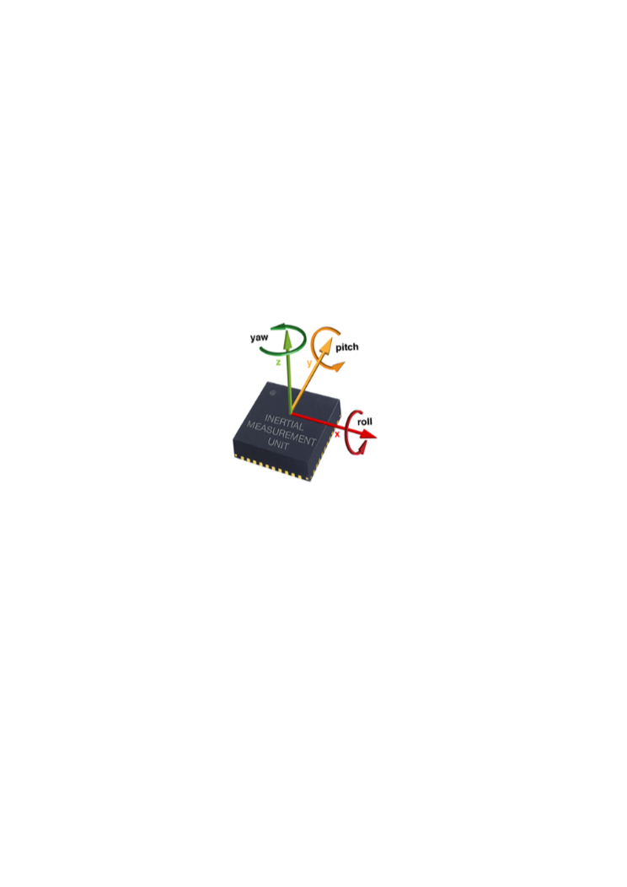

# Autonomy overview {#autonomy_overview}

Assigned: Liam

In this chapter we will introduce some basic concepts ubiquitous in autonomous vehicle navigation.

## Autonomous Vehicles in the News {#autonomous-vehicles-news}

These days it is hard to separate the fact from the fiction when it comes to autonomous vehicles, particularly self-driving cars. Virtually every major car manufacturer has pledged to deploy some form of self-driving technology in the next five years. In addition, there are many startups and software companies which are also known to be developing self-driving car technology.

Here's a non-exhaustive list of some of companies that are actively developing autonomous cars:

 * [Waymo](https://waymo.com/)
 * [Tesla Autopilot project](https://www.tesla.com/en_CA/autopilot?redirect=no)
 * [Uber Advanced Technologies Group](https://www.uber.com/info/atg/)
 * [Cruise Automation](the recent developments)
 * Apple "Project Titan" (no official details released)
 * [nuTonomy](http://nutonomy.com/)
 * [Toyota Research Institute](http://www.tri.global/) (Broader than just autonomous cars)
 * [Aurora Innovation](https://aurora.tech/)
 * [Zoox](http://zoox.com/)
 * [Audi](https://techcrunch.com/2017/06/06/audi-is-the-first-to-test-autonomous-vehicles-in-new-york/)
 * [Nissan's autonomous car](https://www.nissanusa.com/blog/autonomous-drive-car)
 * [Baidu](http://usa.baidu.com/adu/)

## Levels of Autonomy {#autonomy-levels}

Before even discussing any detailed notion of autonomy, we have to specify exactly what we are talking about. In the United States, the governing body is the NHTSA, and they have recently (Oct 2016) redefined the so-called "levels of autonomy" for self-driving vehicles. In broad terms, they are as follows

 * **Level 0**: the human driver does everything;
 * **Level 1**: an automated system on the vehicle can sometimes assist the human
driver conduct some parts of the driving task;
 * **Level 2**: an automated system on the vehicle can actually conduct some parts of the driving task, while the human continues to monitor the driving environment and performs the rest of the driving task;
 * **Level 3**: an automated system can both actually conduct some parts of the driving task and monitor the driving environment in some instances, but the human driver must be ready to take back control when the automated system requests;
 * **Level 4**: an automated system can conduct the driving task and monitor the driving environment, and the human need not take back control, but the automated system can operate only in certain environments and under certain conditions; and
 * **Level 5**: the automated system can perform all driving tasks, under all conditions that a human driver could perform them.

## Basic Building Blocks of Autonomy {#basic-blocks}

The minimal basic backbone processing pipeline for autonomous vehicle navigation is shown in .

  

For an autonomous vehicle to function, it must achieve some level of performance for all of these components. The level of performance required depends on the *task* and the *required performance* .In the remainder of this section, we will discuss some of the most basic options. In [the next section](#advanced-blocks) we will briefly introduce some of the more advanced options that are used in state-of-the-art autonomous vehicles.

### Sensors {#sensors}

    

        
    

    

        
    

    

        
    

    

        
    

    

        
    

\begin{definition}[Sensor]\label{def:sensor}
A *sensor* is a device that or mechanism that is capable of generating a measurement of some external phyiscal quantity
\end{definition}

In general, sensors have two major types. *Passive* sensors generate measurements without affecting the environment that they are measuring. Examples include inertial sensors, odometers, GPS receivers, and cameras. *Active* sensors emit some form of energy into the environment in order to make a measurement. Examples of this type of sensor include Light Detection And Ranging (LiDAR), Radio Detection And Ranging (RaDAR), and Sound Navigation and Ranging (SoNAR). All of these sensors emit energy (from different spectra) into the environment and then detect some property of the energy that is reflected from the environment (e.g., the time of flight or the phase shift of the signal)

### Raw Data Processing {#data-processing}

The raw data that is input from a sensor needs to be  processed in order to become useful and even understandandable to a human.

First, **calibration** is usually required to convert convert units, for example from a voltage to a physical quantity. As a simple example consider a thermometer, which measures temperature via an expanding liquid (usually mercury). The calibration is the known mapping from amount of expansion of liquid to temperature. In this case it is a linear mapping and is used to put the markings on the thermometer that make it useful as a sensor.

We will distiguish between two fundamentally types of calibrations.

\begin{definition}[Intrinsic Calibration]\label{def:intrinsic-calibration}
An *intrinsic calibration* is required to determine sensor-specific paramaters that are internal to a specific sensor.
\end{definition}

\begin{definition}[Extrinsic Calibration]\label{def:extrinsic-calibration}
An *extrinsic calibration* is required to determine the external configuration of the sensor with respect to some reference frame.
\end{definition}

For more information about reference frames check out 

Calibration is very important consideration in robotics. In the field, the most advanced algorithms will fail if sensors are not properly calibrated.

Once we have properly calibrated data in some meaningful units, we often do some preprocessing to reduce the overall size of the data. This is true particularly for sensors that generate a lot of data, like cameras. Rather than deal with every pixel value generated by the camera, we will process an image to generate feature-points of interest. In ``classical" computer vision many different feature descriptors have been proposed (Harris, BRIEF, BRISK, SURF, SIFT, etc), and more recently Convolutional Neural Networks (CNNs) are being used to learn these features.

<!-- dimensionality reduction -->

The important property of these features is that they should be as easily to associate as possible across frames. In order to achieve this, the feature descriptors should be invariant to nuissance parameters.

TODO: add a picture with basic feature detections

### State Estimation {#state-estimation}

Now that we have used our sensors to generate a set of meaningful measurements, we need to combine these measurements together to produce an estimate of the underlying hidden *state* of the robot and possibly to environment.

\begin{definition}[State]\label{def:state}
The state $\state_t \in \statesp$ is a *sufficient statistic* of the environment, i.e. it contains all sufficient information required for the robot to carry out its task in that environment. This can (and usually does) include the *configuration* of the robot itself.
\end{definition}

What variables are maintained in the statespace $\statesp$ depends on the problem at hand. For example we may just be interested in a single robot's configuration in the plane, in which case $\state_t \equiv \pose_t$. However, in other cases, such as simultaneous localization and mapping, me may also be tracking the map in the state space.

According to Bayesian principles, any system parameters that are not fully known and deterministic should be maintained in the state space.

In general, we do not have direct access to values in $\state$, instead we rely on our (noisy) sensor measurements to tell us something about them, and then we *infer* the values.

### Navigation and Planning {#navigation-planning}

State->reference

### Control

reference->control value

### Actuation {#actuation}

Control applied to vehicle

### Infrasctructure and Prior Information {#infrastructure}

## Advanced Building Blocks of Autonomy {#advanced-blocks}

The basic blocks described

### Object Detection {#object-detection}

One key requirement is the ability fo

### Visual Odometry

### SLAM {#slam}

### Scene Segmentation

### Mobility on Demand / Fleet-level optimization {#mobility-on-demand}
