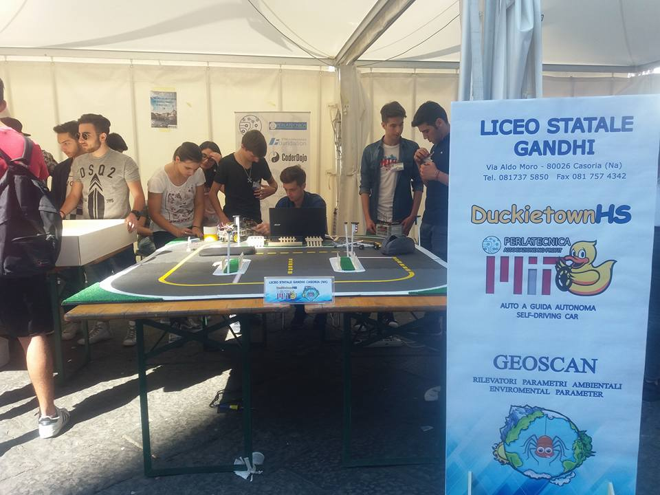

# Duckietown news for June 2017

**Please add / expand items below**

## Duckietown around the world

* Classes at RPI - link to video

* Duckietown High School
  
  DuckietownHS is inspired by the Duckietown project and targeted for high schools.
  The goal is to build and program duckiebots capable of moving autonomously on the streets of Duckietown. 
  Unlike the Duckietown project, duckiebotHS does not use a camera as a sensor, but perception is based on infrared sensors to stay in     the lane, gyroscope and accelerometers to help determine the vehicle's progress and proximity sensors based on technology "Time of       Flight" for avoiding obstacles. 
  Speed is provided by an encoder on the wheel axis. 
  The crossings are operated by traffic lights arranged horizontally on the road. The color is read through a color sensor located on the     bottom of the chassis. 
  The basic mission is to make the vehicle self-driving and respectful of road signs. 
  In addition to the traffic lights there are road signs that provide information about the intersection. The road sign encodes this       information that is read through the infrared sensors.
  Vehicle control is carried out by a NUCLEO-F401RE board that uses a microcontroller ARM®32-bit Cortex®-M4 CPU with FPU.
  The project is promoted by the non-profit organization [Perlatecnica](http://www.perlatecnica.it) based in Italy. Currently, ten Italian high schools are involved     in developing their duckiebots. 
  [Here](https://www.facebook.com/duckietownhs) is the DuckitownHS Facebook page.
  The [Liceo Gandhi di Casoria](https://www.facebook.com/liceogandhicasoria/) school has created [videos](http://duckietownhsliceogandhi.altervista.org/) to present the project and some tutorials on the technologies adopted
  

* Chile

* Other

## Papers

* Paper education published

* Paper ICRA 2017 published

* LaPenta's thesis

* Other papers 

## Future things

* Duckumentary is ready - planning screening

* Fall 2017 plans - Montreal, ETHZ, Chicago

* New document system
