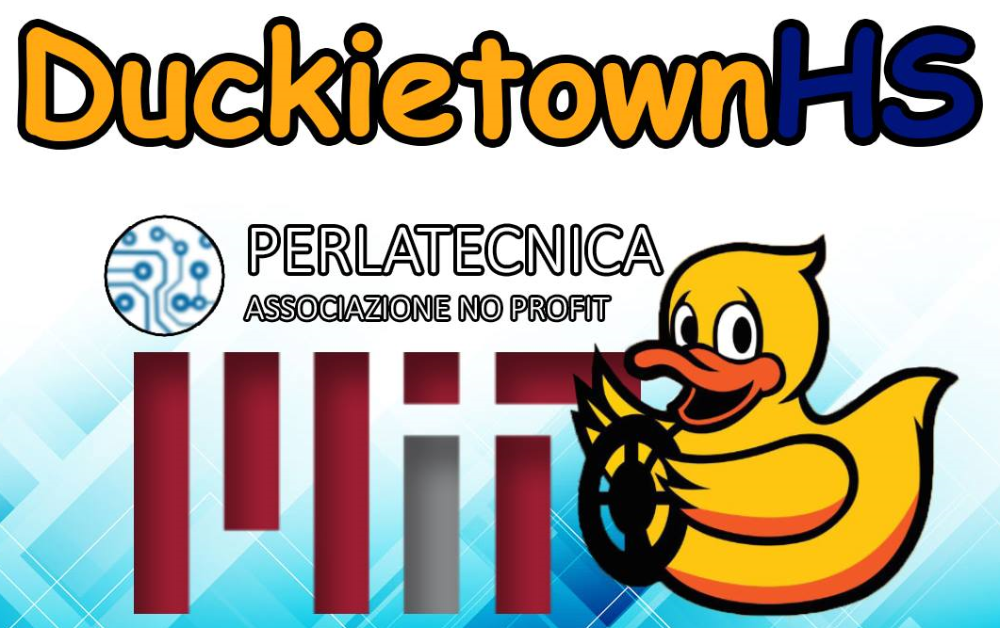
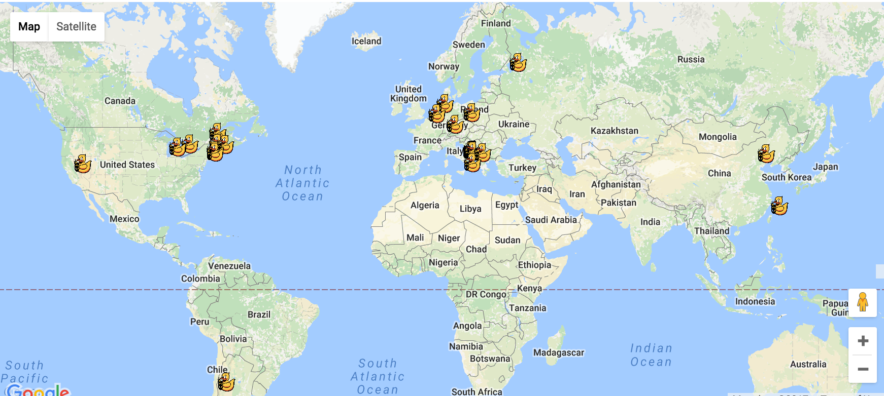

# Duckietown news for June 2017

**Please add / expand items below**

## Duckietown around the world

* Classes at RPI - link to video

  
  DuckietownHS is inspired by the Duckietown project and targeted for high schools.
  The goal is to build and program duckiebots capable of moving autonomously on the streets of Duckietown. 
  Unlike the Duckietown project, duckiebotHS does not use a camera as a sensor, but perception is based on infrared sensors to stay in     the lane, gyroscope and accelerometers to help determine the vehicle's progress and proximity sensors based on technology "Time of       Flight" for avoiding obstacles. 
  Speed is provided by an encoder on the wheel axis. 
  The crossings are operated by traffic lights arranged horizontally on the road. The color is read through a color sensor located on the     bottom of the chassis. 
  The basic mission is to make the vehicle self-driving and respectful of road signs. 
  In addition to the traffic lights there are road signs that provide information about the intersection. The road sign encodes this       information that is read through the infrared sensors.
  Vehicle control is carried out by a NUCLEO-F401RE board that uses a microcontroller ARM®32-bit Cortex®-M4 CPU with FPU.
  The project is promoted by the non-profit organization [Perlatecnica](http://www.perlatecnica.it) based in Italy. Currently, ten Italian high schools are involved     in developing their duckiebots. 
  [Here](https://www.facebook.com/duckietownhs) is the DuckitownHS Facebook page.
  The [Liceo Gandhi di Casoria](https://www.facebook.com/liceogandhicasoria/) school has created [videos](http://duckietownhsliceogandhi.altervista.org/) to present the project and some tutorials on the technologies adopted
 The school [Ferraris-Buccini di Marcianise](http://www.isismarcianise.gov.it/ferraris-buccini/) has recently participated in the [italian robotics Olympics](http://www.olimpiadirobotica.it/), ranking fourth 

* Chile

The Duckietown project arrived in Chile under the name [Duckietown Engineering Chile](http://duckietown.cl/), managed by the (Student) Robotics Community of the Universidad de Chile. The goal was to implement Duckietown as an undergraduate elective course for second year engineering students to teach some basic concepts of robotics such as perception and localization.
The course is implemented following the role-playing approach, where teachers present themselves as a fictional company, whereas students take the role of _trainee_ engineers. 
The methodology was based in three main phases: 

**Phase I:** The students build the robots and learn some basic concepts of software tools and ROS.

**Phase II:** They learn concepts of perception and localization

**Phase III (in process):** They develop mini projects to learn different topics.

**Resources**

_Official website (preliminary):_ [link](http://duckietown.cl/)

_Facebook page:_ [link](https://www.facebook.com/duckietowncl/). There are pictures available here.

_Github Repository:_ [link](https://github.com/duckietown-chile). This includes some hardware and software modifications to the original duckiebot, such as an Arduino-based low-cost custom shield to replace Adafruit's.

**Future plans**

We are planning to teach a second part focused on "long-term" projects for the second semester (in Chile this goes from August to November).
Also, we are interested in publish a paper with the experience of developing Duckietown in some local education-related conference.

* Other

## Papers

* Paper education published

* Paper ICRA 2017 published

* LaPenta's thesis

* Other papers 

## Future things

* Duckumentary is ready - planning screening

* Fall 2017 plans - Montreal, ETHZ, Chicago

* New document system

## Duckietown around the world (Russia)

Russian team led by Kirill Krinkin (JetBrains Reasearch) has joined Duckietown activities. A students team of Computer Science Center (compscicenter.ru) has built a first duckie-town prototype (photos); created duckie-bot (there some part replacements and motor driver re-programming was required); autonomous ride has been successfully ran.

### Future plans:

  * building traffic control infrastructure (traffic lights, signs etc)
  * run a course in computer science center during the fall semester in experimental mode
  * do rearch on path planning and increasing road markup robustness
  
### Links:

  * [Project Page](https://research.jetbrains.org/duckietown)
  * [Some photos/videos collected here](http://wiki.osll.ru/doku.php/projects:duckietown:start)
  

